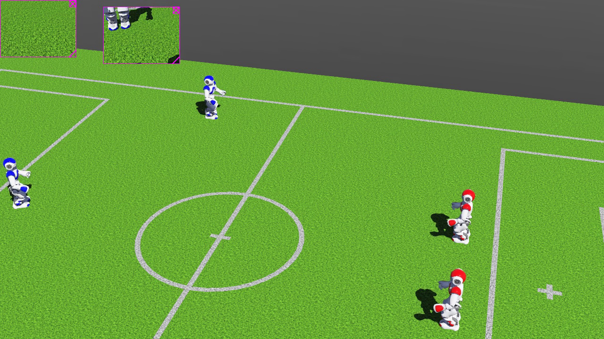
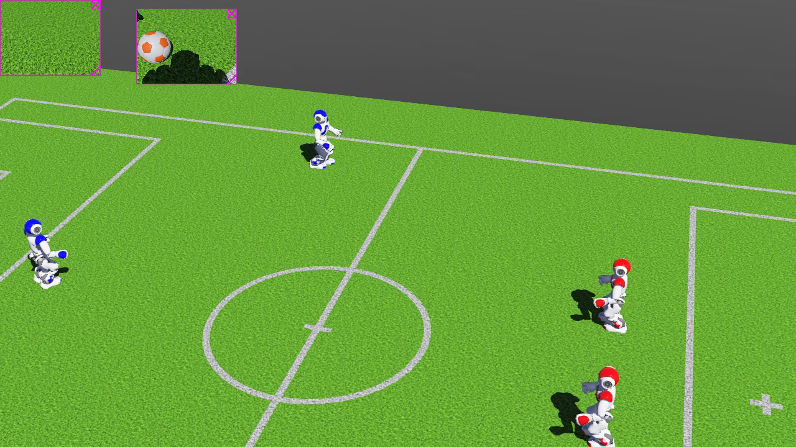
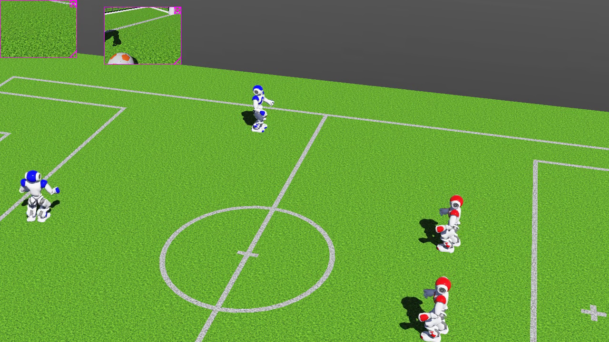
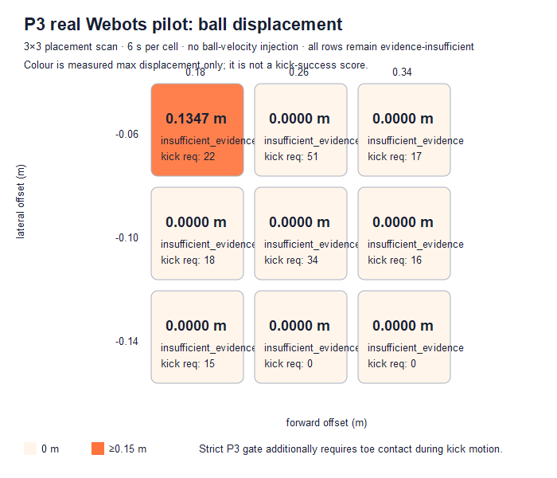

# RoboSoccer Team 6 — evidence-gated NAO football in Webots

> A reproducible 4v4 NAO football simulation for camera perception, localization baselines, role-based planning, motion playback, foot-ball contact, and multi-agent coordination.

**Status — 2026-09-15:** the football world, eight controllers, camera-ball baseline, role behaviours, telemetry, video capture, and a repeatable fixed-pose physical-kick baseline run in Webots. The repository does **not** claim a validated pass rate, goal rate, role improvement, or 15-minute match outcome.

## Contents

- [Scope and non-claims](#scope-and-non-claims)
- [System workflow](#system-workflow)
- [Real visual evidence](#real-visual-evidence)
- [Measured results](#measured-results)
- [Quick start](#quick-start)
- [Reproduce an evidence run](#reproduce-an-evidence-run)
- [Parameters and evaluation gates](#parameters-and-evaluation-gates)
- [Repository layout](#repository-layout)
- [Roadmap](#roadmap)

## Scope and non-claims

This repository keeps the original football pitch, embedded NAO world, eight players (4v4), physics-enabled ball, and individual Python controllers. It distinguishes three different facts:

| Claim | Required evidence | Current state |
|---|---|---|
| A controller selected a kick/pass motion | controller action JSONL | verified |
| A foot physically kicked the ball at a calibrated pose | toe contact *during kick motion* + ball velocity/displacement | verified; 3 deterministic repeats |
| A role or team improved | equal-condition, multi-seed match telemetry | not started — blocked by P3 |

Supervisor ball pose is retained as evaluation truth only. Set `ROBOCUP_BALL_SOURCE=camera` to prohibit controller use of ball truth; each NAO estimates the ball from CameraTop/CameraBottom RGB. The current detector is an orange colour-segmentation baseline, not a learned competition detector.

## System workflow

```text
CameraTop / CameraBottom RGB
        │  (P1 detector, bearing/range)
        ▼
GPS + IMU baseline ──► role behaviour ──► motion queue ──► NAO joints / foot sensors
        │                    │                    │                 │
        └── evaluation only ◄┴──── Supervisor truth / action logs ──┘
                                      │
                                      ▼
                         ball velocity, displacement, score events
```

The behaviour layer includes goalkeeper, defender, and forward controllers; single-chaser selection, support positioning, pass-lane screening, collision avoidance, recovery, approach, align, kick/pass choice, and follow-up behaviours. Decision availability does not imply physical execution: the P3 gate enforces that distinction.

## Real visual evidence

The images below are copied from an actual 14-second Webots recording, not generated illustrations. They show the preserved football scene and the candidate approach/turn/strike-follow-through sequence; they do not establish a goal.

| Approach / alignment, 4 s | Candidate kick motion, 8 s | Follow-through, 12 s |
|---|---|---|
|  |  |  |

Raw MP4 and JSONL stay local under `evidence/` rather than being committed as source assets.

## Measured results

### P1 camera-only baseline

An 8-second camera-only Webots run recorded 1,000 controller perception samples; 261 had a detection (26.1%). Coverage ranged from 0% for both goalkeepers to 96.0% for `RED_FW`. This is a diagnostic baseline, not a perception-quality claim; see `P1_P4_CONTINUATION_REPORT.md` for the methodology and per-role errors.

### P3 real ball-placement pilot

The figure is generated from nine real 6-second Webots runs. It reports maximum measured ball displacement only. Every cell is `insufficient_evidence`: early runs lacked controller-side foot telemetry, so ball movement cannot honestly be attributed to a kick.



The first 14-second confirmation recorded `0.35002 m` maximum displacement and `0.14389 m/s` peak speed, but toe-bumper contact occurred during `turnRight10`, not `rightShoot`; it remains a failed attribution example. A later strike-corridor scan found a calibrated right-foot baseline at `(0.14 m, -0.04 m)`: three independent deterministic repeats all recorded kick-window contact, `0.48711 m` displacement, and `0.69896 m/s` peak speed, with no ball-velocity injection. This is not a match goal-rate claim. See `P3_KICK_CALIBRATION_REPORT.md`.

The exact versioned values and source-artifact SHA-256 are in [`reports/p3_kick_repeatability_summary.csv`](reports/p3_kick_repeatability_summary.csv); its measurement scope is documented in [`reports/DATA_PROVENANCE.md`](reports/DATA_PROVENANCE.md).

### P0 strict-camera 4v4 regression

A real 300-second strict-camera window completed at 0–0 with zero detections in 37,379 samples and 846 mobile-role boundary samples. After adding camera-loss search and GPS/IMU boundary recovery to forwards, a real 60-second regression completed at 0–0 with 9/7,379 detections (0.12%) and **0 mobile-role boundary samples**. This proves the boundary safeguard, not game-play performance; it also exposes perception recall as the next blocker. See `P0_CAMERA_REGRESSION_REPORT.md`.

Both raw summaries are preserved as [`reports/p0_camera_boundary_regression_summary.csv`](reports/p0_camera_boundary_regression_summary.csv). The durations differ, so this is a safety regression rather than a performance comparison.

## Quick start

### Prerequisites

- Windows with Webots R2023a-compatible installation
- Python 3.x available to Webots controllers
- Optional: FFmpeg for extracting video stills

### Open the playable football world

1. Launch Webots.
2. Open `worlds/nao_soccer.wbt`.
3. Press **Run**. Webots launches one Supervisor plus eight player-controller processes.
4. Observe the original 4v4 football pitch in the scene tree or movie recorder.

The interactive world remains open-ended. Automation uses environment variables only; it does not alter the pitch or inject ball velocity.

## Reproduce an evidence run

From the project root in PowerShell:

```powershell
python -m unittest discover -s tests -v
python tools\run_kick_calibration_pilot.py
python tools\run_kick_contact_confirmation.py
python tools\run_kick_repeatability.py
```

The pilot starts nine independent Webots processes and refuses to overwrite evidence. The confirmation runner records MP4 plus controller/supervisor JSONL. If needed:

```powershell
$env:WEBOTS_EXECUTABLE = 'C:\Program Files\Webots\msys64\mingw64\bin\webots.exe'
```

Useful controls:

| Variable | Meaning | Default |
|---|---|---|
| `ROBOCUP_BALL_SOURCE` | `camera`, `fused`, or legacy `supervisor` controller input | `supervisor` |
| `ROBOCUP_MATCH_SECONDS` | finite automation window; `0` keeps live play open | `0` |
| `ROBOCUP_SCENARIO` | deterministic fixture, including `kick_calibration` | `kickoff` |
| `ROBOCUP_EVIDENCE_DIR` | fresh JSONL evidence directory | `evidence/latest` |
| `ROBOCUP_MOVIE_PATH` | optional MP4 path | unset |
| `ROBOCUP_KICK_ALIGNMENT_DEG` | bounded [5°, 30°] close-ball alignment tolerance | `15` |

Use `python tools\analyze_kick_calibration.py <run-dir> --csv <output.csv>` to re-evaluate a run. The analyser refuses success without kick-window toe contact and measured ball motion.

## Parameters and evaluation gates

`configs/role_parameter_matrix.json` provides candidate controls for goalkeeper, defender, forward, and shared behaviours. `EVALUATION_MATRIX.md` maps them to metrics and safety guards.

1. P3: repeatedly pass physical kick-contact evidence. The fixed-pose baseline has passed; field approach integration remains next.
2. P0: run a labelled 5-minute fixed-condition baseline with `python tools\run_fixed_window_match.py`; then introduce controlled seed variation for candidate comparison.
3. P4/P5: run equal-condition 15-minute 4v4 matches; report medians and intervals for shots, saves, interceptions, possession-to-shot latency, falls, collisions, and boundary events.

No table reports the illustrative targets “1.2→1.7 goals”, “5.4→6.8 interceptions”, or “0.41→0.60 saves” as observed results.

## Repository layout

```text
worlds/       original 4v4 football scene
controllers/  player behaviour, Supervisor, perception and telemetry
motions/      original and retargeted NAO motion assets
configs/      parameter-search design
tools/        calibration runners, analyses and README visual generator
tests/        detector unit tests
media/        versioned stills and figures sourced from recorded evidence
```

## Roadmap

| Phase | Scope | Gate |
|---|---|---|
| P1 | camera ball detection and tracking | controller must not consume Supervisor ball truth |
| P2 | noisy GPS/IMU, odometry, EKF, landmark localization | compare estimates against truth-only logs |
| P3 | foot pose/contact calibration, trajectory and balance | toe contact during kick motion + observed ball motion |
| P4 | dynamic roles, pass selection, interception/formation search | physically verified pass/shot before team statistics |
| P5 | multi-seed 5-minute tuning and 15-minute 4v4 evaluation | raw telemetry, manifests, video and reproducible summaries |

## Provenance

Webots Supervisor is used only for evaluation, reset, telemetry and optional recording. Its privileged simulation access is not treated as a robot capability. The football has a Physics node so contact can move it. See the official [Supervisor guide](https://www.cyberbotics.com/doc/guide/supervisor-programming?version=master) and [physics reference](https://github.com/cyberbotics/webots/blob/master/docs/reference/physics.md).
